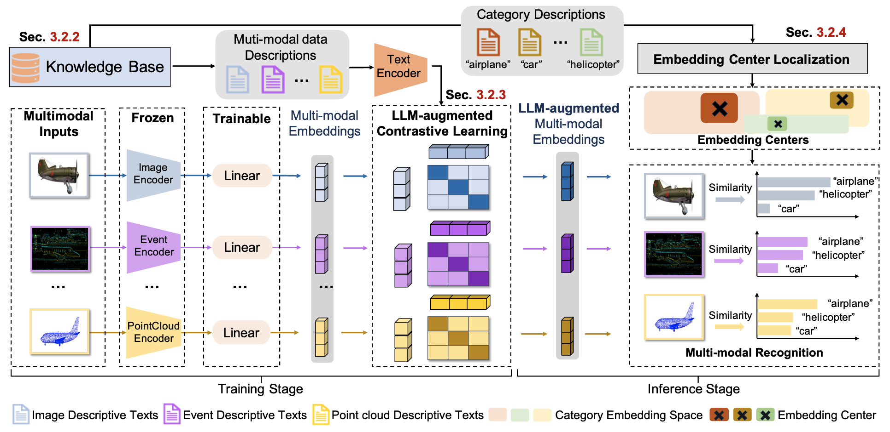

# UniBind: LLM-Augmented Unified and Balanced Representation Space to Bind Them All

The source code for ["UniBind: LLM-Augmented Unified and Balanced Representation Space to Bind Them All"]() (**CVPR 2024**).



## Requirements

```
git clone https://github.com/qc-ly/UniBind
cd UniBind
conda create -n unibind python==3.9
conda activate unibind
conda install pytorch==1.13.0 torchvision==0.14.0 torchaudio==0.13.0 pytorch-cuda=11.6 -c pytorch -c nvidia
conda install cartopy
pip install -r requirements.txt
```

## Quick Start

1. Download the **pre-trained weights** from [[link](https://drive.google.com/file/d/1Dgmj7ajdoT8hYHobJQfgIuB4CbVRoKUn/view?usp=sharing)] to `./ckpts/`

2. Download the **centre embeddings** from [[link](https://drive.google.com/drive/folders/1aQ654WO9jFuK6bqz2YqhAVrT0vvXPiJW?usp=sharing)] to `./centre_embs/`

3. **Inference for 6 modalities**: We have provided some sample data in `./assets/` to quickly see how UniBind works.

   For **image** modality:

   ```shell
   CUDA_VISIBLE_DEVICES=0 python demo_for_image.py
   ```

   ​		Output:

   ```
   The categories are: ['folding chair', 'Shetland sheepdog, Shetland sheep dog, Shetland']
   ```

   For **audio** modality:

   ```shell
   CUDA_VISIBLE_DEVICES=0 python demo_for_audio.py
   ```

   ​		Output:

   ```
   The categories are: ['airplane', 'car_horn']
   ```

   For **video** modality:

   ```shell
   CUDA_VISIBLE_DEVICES=0 python demo_for_video.py
   ```

   ​		Output:

   ```
   The categories are: ['vehicles/autos', 'education']
   ```

   For **point cloud** modality:

   ```shell
   CUDA_VISIBLE_DEVICES=0 python demo_for_point.py
   ```

   ​		Output:

   ```
   The categories are: ['airplane', 'car']
   ```

   For **thermal** modality:

   ```shell
   CUDA_VISIBLE_DEVICES=0 python demo_for_thermal.py
   ```

   ​		Output:

   ```
   The categories are: ['person', 'background']
   ```

   For **event** modality:

   ```
   CUDA_VISIBLE_DEVICES=0 python demo_for_event.py
   ```

   ​		Output:

   ```
   The categories are: ['gerenuk', 'sea_horse']
   ```

## Zero-shot && Fine-tune

1. Download the **pre-trained weights** from [[link]()] to `./ckpts/`

2. Download the **centre embeddings** from [[link]()] to `./centre_embs/`

3. Generate the multi-modal data descriptions for your dataset via LLaMA-Adapter and GPT-4. Here we show the demo code for generating descriptions via LLaMA-Adapter:

   ```python
   import ImageBind.data as data
   import llama
   from tqdm import tqdm
   import pickle
   import json
   import torch
   llama_dir = "llama/llama_model_weights"
   model = llama.load(LLaMA_weight_path, llama_dir, knn=True)
   model.eval()
   model.cuda()
   descriptions = []
   video_data_list = []
   with open(video_meta_data_path, 'r') as f:
       data = json.load(f)
       for line in data:
           video_data_list.append(line['video'])
   for i, video in enumerate(tqdm(video_data_list)):
       inputs = {}
       video_data = data.load_and_transform_video_data([video_path+video], device='cuda')
       inputs['Video'] = [video_data, 1]
       with torch.no_grad():
           results = model.generate(
               inputs,
               [llama.format_prompt(f"Describe the video.")],
               max_gen_len=77
           )
       result = results[0].strip()
       descriptions.append(result)
   ```

4. Process the **datasets** in the following form:

   ```
   |----datasets/
   |--------ImageNet-1k/
   |------------train_dataset/
   |----------------0.jpg
   |----------------1.jpg
   |----------------...
   |------------eval_dataset/
   |------------test_dataset/
   |------------train_data.json
   |------------eval_data.json
   |------------test_data.json
   |--------...
   |--------ESC-50/
   ```

   The data format of the `train_data.json` is shown as follows:

   ```json
   [
     {
       "data": data_file_name,
       "description": descriptive_text,
       "label": label,
     }
     ...
   ]
   ```

   The data format of the `eval_data.json` and `test_data.json` is shown as follows:

   ```json
   [
     {
       "data": data_file_name,
       "label": label,
     }
     ...
   ]
   ```

5. Running for **zero-shot** setting.

   ```shell
   cd scripts
   bash zero_shot.sh
   ```

6. Running for **fine-tune** setting.

   ```shell
   cd scripts
   bash fine_tune.sh
   ```

## Acknowledgement

Our codes are built on open-source codes, thanks to the following projects:

* [ImageBind](https://github.com/facebookresearch/ImageBind)
* [PointBind](https://github.com/ZiyuGuo99/Point-Bind_Point-LLM)
* [LLaMA-Adapter](https://github.com/OpenGVLab/LLaMA-Adapter)
* [E-CLIP](https://github.com/jiazhou-garland/E-CLIP)

## Citation

If you find this repository useful, please consider giving stars ⭐ and citations

```
@inproceedings{girdhar2023imagebind,
  title={Imagebind: One embedding space to bind them all},
  author={Girdhar, Rohit and El-Nouby, Alaaeldin and Liu, Zhuang and Singh, Mannat and Alwala, Kalyan Vasudev and Joulin, Armand and Misra, Ishan},
  booktitle={Proceedings of the IEEE/CVF Conference on Computer Vision and Pattern Recognition},
  pages={15180--15190},
  year={2023}
}
```
```
@article{guo2023point,
  title={Point-bind \& point-llm: Aligning point cloud with multi-modality for 3d understanding, generation, and instruction following},
  author={Guo, Ziyu and Zhang, Renrui and Zhu, Xiangyang and Tang, Yiwen and Ma, Xianzheng and Han, Jiaming and Chen, Kexin and Gao, Peng and Li, Xianzhi and Li, Hongsheng and others},
  journal={arXiv preprint arXiv:2309.00615},
  year={2023}
}
```
```
@article{zhang2023llama,
  title={Llama-adapter: Efficient fine-tuning of language models with zero-init attention},
  author={Zhang, Renrui and Han, Jiaming and Zhou, Aojun and Hu, Xiangfei and Yan, Shilin and Lu, Pan and Li, Hongsheng and Gao, Peng and Qiao, Yu},
  journal={arXiv preprint arXiv:2303.16199},
  year={2023}
}
```
```
@inproceedings{lyu2024unibind,
  title={UniBind: LLM-Augmented Unified and Balanced Representation Space to Bind Them All},
  author={Lyu, Yuanhuiyi and Zheng, Xu and Zhou, Jiazhou and Wang, Lin},
  booktitle={Proceedings of the IEEE/CVF Conference on Computer Vision and Pattern Recognition},
  pages={},
  year={2024}
}
```

## Contact

```
lvyuanhuiyi@foxmail.com
```

